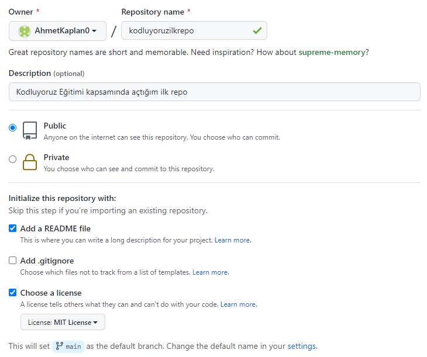

# Kodluyoruz Ilk Repo

Bu repo [Patika.dev](https://www.patika.dev/) Java ile Backend Web Development eğitiminde oluşturduğumuz ilk repo. İçerisinde bir adet README dosyası, index.html ve bir adet de proje resmi barındırıyor.



## Installation

Öncelikle projeyi clonelayın.

```bash
git clone https://github.com/AhmetKaplan0/kodluyoruzilkrepo.git
```

## Usage

Projeyi cloneladıktan sonra Visual Studio Code programında açınız.

Linux için:
```linux
cd kodluyoruzilkrepo
code .
```

## Contributing
Pull requestler kabul edilir. Büyük değişiklikler için, lütfen önce neyi değiştirmek istediğinizi tartışmak için bir konu açınız.


## License
[MIT](https://choosealicense.com/licenses/mit/)